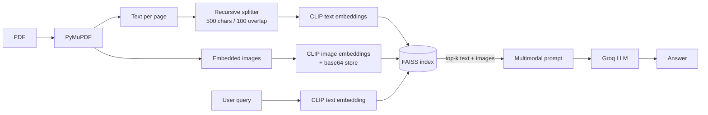

# Multimodal RAG over PDFs (CLIP + FAISS + Groq)

A retrieval-augmented generation pipeline that answers questions about a PDF using both its **text and its images**. Text chunks and embedded images are placed in the same CLIP vector space, retrieved together with FAISS, and passed to a vision-capable LLM on Groq.

## How it works



1. **Ingest**: PyMuPDF extracts text and embedded images from every page.
2. **Chunk**: page text is split with `RecursiveCharacterTextSplitter` (500 chars, 100 overlap).
3. **Embed**: `openai/clip-vit-base-patch32` embeds text chunks and images into one shared, normalized vector space.
4. **Index**: all vectors go into a single FAISS store, with metadata (`page`, `type`, `image_id`).
5. **Retrieve**: the query is embedded with CLIP and the top-k nearest text chunks and images are returned.
6. **Generate**: retrieved text and base64 images are assembled into one multimodal message and sent to a Groq-hosted model.

## Tech stack

- Python 3.13+
- PyMuPDF, Pillow
- Hugging Face Transformers (CLIP), PyTorch
- LangChain (`langchain-core`, `langchain-community`, `langchain-text-splitters`, `langchain-groq`)
- FAISS (CPU)
- python-dotenv

## Project structure

```
.
├── main.py                 # ingestion, retrieval and generation pipeline
├── multimodal_sample.pdf   # sample PDF (revenue report with a bar chart)
├── requirements.txt
├── pyproject.toml
├── uv.lock
├── .python-version
└── .gitignore
```

## Setup

```bash
git clone -b multi-modal-rag https://github.com/IshwarRajChauhan/langchain-try.git
cd langchain-try
```

Using **uv** (recommended, lockfile included):

```bash
uv sync
```

Or with pip:

```bash
python -m venv .venv
source .venv/bin/activate      # Windows: .venv\Scripts\activate
pip install -r requirements.txt
```

Create a `.env` file in the project root:

```env
GROQ_API_KEY=your_groq_api_key
```

Get a key from the [Groq Console](https://console.groq.com/).

## Usage

```bash
uv run main.py        # or: python main.py
```

The CLIP model is downloaded from Hugging Face on first run.

`main.py` indexes `multimodal_sample.pdf` and runs three example queries:

```
What does the chart on page 2 show about revenue trends?
Summarize the main findings from the document
What visual elements are present in the document?
```

Each query prints the retrieved chunks (text preview or image, with page number) followed by the model's answer.

To use your own PDF or questions, edit `pdf_path` and the `queries` list in `main.py`. To query programmatically:

```python
answer = multimodal_pdf_rag_pipeline("What does the bar chart show?")
print(answer)
```

## Configuration

| Setting | Where | Default |
| --- | --- | --- |
| PDF path | `pdf_path` | `multimodal_sample.pdf` |
| Chunk size / overlap | `RecursiveCharacterTextSplitter` | 500 / 100 |
| Top-k retrieved | `retrieve_multimodal(query, k=5)` | 5 |
| Embedding model | `CLIPModel.from_pretrained` | `openai/clip-vit-base-patch32` |
| LLM | `ChatGroq(model=...)` | `qwen/qwen3.6-27b`, temperature 0, 800 max tokens |

The LLM must accept image input, since retrieved images are sent as base64 `image_url` content.

## Known limitations

- CLIP's text encoder truncates at 77 tokens, so long chunks are only partly embedded. Smaller chunks give better retrieval.
- Only embedded raster images are extracted. Vector graphics and scanned pages are not.
- The index is rebuilt in memory on every run and is not persisted.
- Page numbers in metadata are 0-indexed.

## Roadmap

- [ ] Persist the FAISS index to disk
- [ ] CLI or Streamlit interface for uploading PDFs and asking questions
- [ ] Re-ranking of retrieved results
- [ ] Support for tables and scanned pages (OCR)
