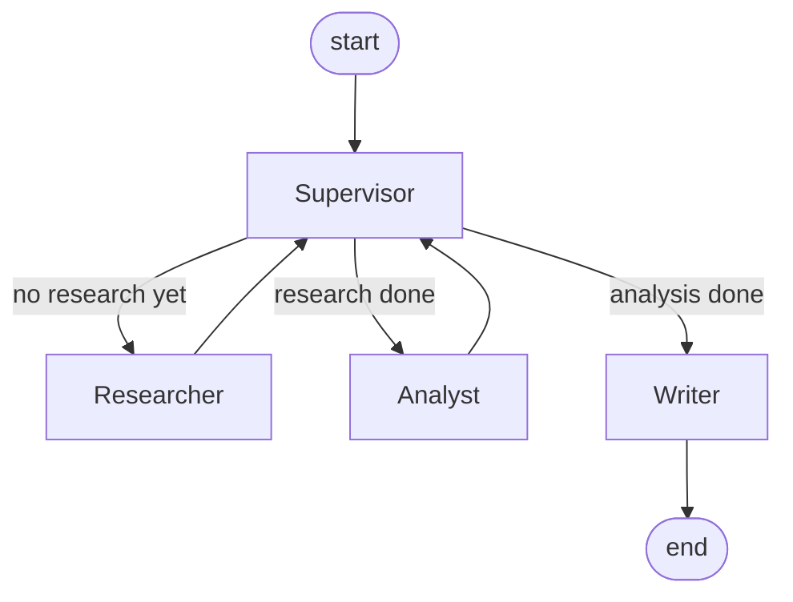
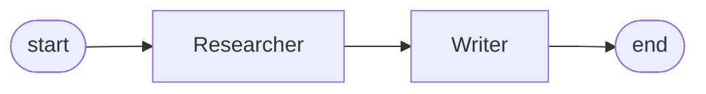

# Multi-Agent Systems with LangGraph + Groq

Two small projects that show how to get several LLM agents to work together.

| Script | Setup | What it does |
| --- | --- | --- |
| `multiaiagent.py` | Supervisor | A supervisor LLM decides who works next: Researcher, Analyst, or Writer. Ends with a full report. |
| `singleaiagent.py` | Straight line | Researcher (with Tavily web search) passes to a Writer, which gives the final answer. |

Both use open models on Groq and save a picture of their graph as a PNG.

## Supervisor version (`multiaiagent.py`)



- **Supervisor** asks the LLM who should go next, based on what's done so far. If the reply is unclear, it falls back to simple rules.
- **Researcher** collects background, trends, numbers, and examples.
- **Analyst** turns that into insights, risks, opportunities, and recommendations.
- **Writer** writes the final report: summary, key findings, analysis, recommendations, conclusion.
- All agents share one state: the chat messages plus `research_data`, `analysis`, `final_report`, `next_agent`, `current_task`, and `task_complete`.
- Model: `openai/gpt-oss-120b`, temperature 0.

Graph picture: `multi_agent_graph.png`

Example task: *"What are benefits and risks of AI in healthcare?"*

## Straight-line version (`singleaiagent.py`)



- **Researcher** has a Tavily `search_web` tool attached.
- **Writer** reads the conversation and writes the answer.
- Model: `openai/gpt-oss-20b` through `init_chat_model("groq:...")`.

Graph picture: `single_agent_graph.png`

Example task: *"Research about the usecase of agentic AI in business"*

## Tech used

- Python 3.13+
- LangGraph and LangChain
- `langchain-groq` for Groq
- `langchain-tavily` / `tavily-python` for web search
- python-dotenv

## Files

```
.
├── multiaiagent.py        # supervisor version
├── singleaiagent.py       # researcher -> writer
├── multi_agent_graph.png
├── single_agent_graph.png
├── requirements.txt
├── pyproject.toml
├── uv.lock
├── .python-version
└── .gitignore
```

## Setup

```bash
git clone -b multi-agents https://github.com/IshwarRajChauhan/langchain-try.git
cd langchain-try
```

With uv:

```bash
uv sync
```

Or with pip:

```bash
python -m venv .venv
source .venv/bin/activate      # Windows: .venv\Scripts\activate
pip install -r requirements.txt
```

Make a `.env` file:

```env
GROQ_API_KEY=your_groq_api_key
TAVILY_API_KEY=your_tavily_api_key   # only needed for singleaiagent.py
```

Keys: [Groq Console](https://console.groq.com/) and [Tavily](https://tavily.com/).

## Run it

```bash
uv run multiaiagent.py       # supervisor version
uv run singleaiagent.py      # researcher -> writer
```

(Or `python <script>.py` inside your virtualenv.)

Each script prints the graph, saves the PNG, runs the example task, and prints the result. To try your own task, change the `HumanMessage` text at the bottom of the script. Saving the PNG needs internet, since LangGraph uses an online Mermaid renderer for it.

## What you can learn from it

- Sharing state between agents with `MessagesState`
- Routing with a supervisor and conditional edges
- Letting the LLM decide, with simple rules as backup
- Giving each agent a role through its prompt
- Attaching a tool (Tavily search) to an agent
- Saving a graph as Mermaid and PNG

## Things to know

- In `multiaiagent.py`, the researcher only uses what the model already knows. No live web search, so numbers may be out of date.
- In `singleaiagent.py`, the search tool is attached to the researcher but nothing in the graph actually runs it yet, so searches don't happen.
- No memory between runs.

## To do

- [ ] Add a tool-running step so Tavily search works in the pipeline
- [ ] Give the supervisor version's Researcher web search
- [ ] Add `MemorySaver` so it can remember across turns
- [ ] Add a human approval step before the Writer finishes
