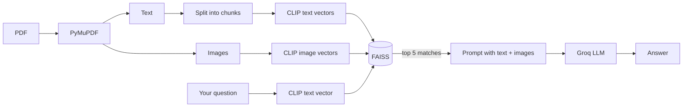

# Multimodal RAG on PDFs

Ask questions about a PDF and get answers that use both the text and the images in it. Text chunks and images are turned into vectors with CLIP, stored in FAISS, and the best matches are sent to an LLM on Groq.

## How it works



1. PyMuPDF pulls the text and images out of each page.
2. Text is split into chunks (500 characters, 100 overlap).
3. CLIP (`openai/clip-vit-base-patch32`) turns both text and images into vectors in the same space, so one search covers both.
4. Everything goes into one FAISS index, with page number and type saved alongside.
5. Your question is turned into a vector and the 5 closest matches are fetched.
6. The matched text and images (as base64) go to the LLM in a single message, and it answers.

## Tech used

- Python 3.13+
- PyMuPDF, Pillow
- Transformers + PyTorch (CLIP)
- LangChain (core, community, text splitters, Groq)
- FAISS (CPU)
- python-dotenv

## Files

```
.
├── main.py                 # the whole pipeline
├── multimodal_sample.pdf   # sample PDF with a bar chart
├── requirements.txt
├── pyproject.toml
├── uv.lock
├── .python-version
└── .gitignore
```

## Setup

```bash
git clone -b multi-modal-rag https://github.com/IshwarRajChauhan/langchain-try.git
cd langchain-try
```

With uv:

```bash
uv sync
```

Or with pip:

```bash
python -m venv .venv
source .venv/bin/activate      # Windows: .venv\Scripts\activate
pip install -r requirements.txt
```

Make a `.env` file:

```env
GROQ_API_KEY=your_groq_api_key
```

You can get a key from the [Groq Console](https://console.groq.com/).

## Run it

```bash
uv run main.py        # or: python main.py
```

The CLIP model downloads the first time you run it.

It loads `multimodal_sample.pdf` and runs three example questions:

```
What does the chart on page 2 show about revenue trends?
Summarize the main findings from the document
What visual elements are present in the document?
```

For each one it prints what it found (text preview or image, with page number), then the answer.

To use your own PDF or questions, change `pdf_path` and the `queries` list in `main.py`. You can also call it directly:

```python
print(multimodal_pdf_rag_pipeline("What does the bar chart show?"))
```

## Settings you can change

| What | Where | Default |
| --- | --- | --- |
| PDF | `pdf_path` | `multimodal_sample.pdf` |
| Chunk size / overlap | `RecursiveCharacterTextSplitter` | 500 / 100 |
| Results returned | `retrieve_multimodal(query, k=5)` | 5 |
| Embedding model | `CLIPModel.from_pretrained` | `openai/clip-vit-base-patch32` |
| LLM | `ChatGroq(model=...)` | `qwen/qwen3.6-27b`, temp 0, 800 max tokens |

The LLM has to accept images, since matched images are sent along with the text.

## Things to know

- CLIP only reads the first 77 tokens of a text chunk, so longer chunks get cut off. Smaller chunks work better.
- It only picks up normal embedded images. Drawn graphics and scanned pages are missed.
- The index is rebuilt every run. Nothing is saved.
- Page numbers start at 0.

## To do

- [ ] Save the FAISS index to disk
- [ ] Simple UI to upload a PDF and ask questions
- [ ] Re-rank the results
- [ ] Handle tables and scanned pages (OCR)
